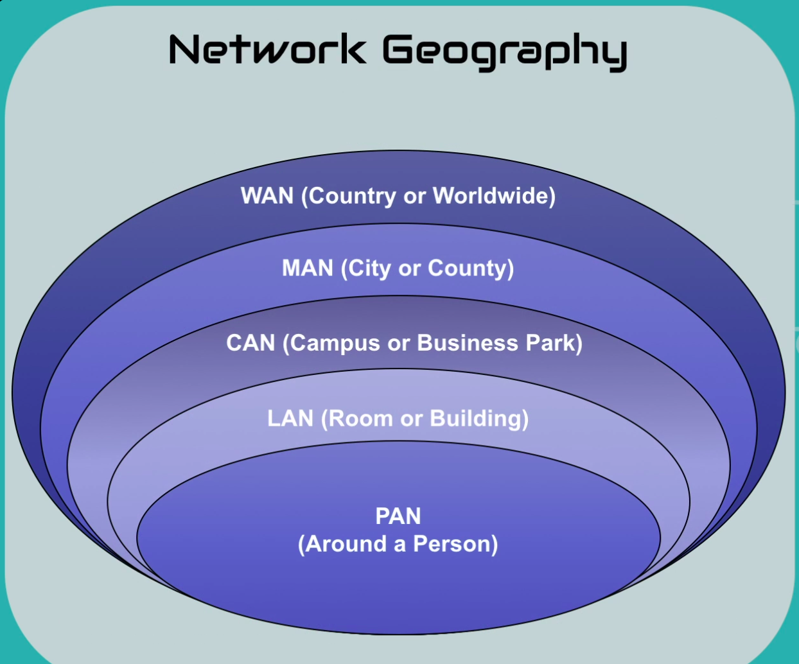

##### Network Geography 

- Personal Area Network(PAN):
  - Smallest type of wired or wireless network (around less than 10 meters)
  - Covers the least amount of area (few meters)
  - Examples:
    - Bluetooth cellphone to car
    - USB hard drive to laptop
    - Firewire video camera to computer

- Local Area Network(LAN):
  - Connects components in a limited distance
  - Each segment is limited to short distances such as 100 meters with CAT 5 cabling
  - Consists of Ethernet (IEEE 802.3) or WiFi networks (IEEE 802.11)
  - Examples:
    - Internal wired or wireless networks

- Campus Area Network(CAN):
  - Connects building-centric LANs across a university, industrial park, or business parky
  - Covers many square miles and buildings
  - Examples:
    - College campus
    - Business Parks
    - Military bases

- Metropolitan Area Network(MAN):
  - Connects scattered locations across a city
  - Larger than a CAN, but smaller than a WAN
  - Covers up to a 25 mile radius in larger cities
  - Examples:
    - City departments like the police department
    - Community college with campuses spread across a county

- Wide Area Network(WAN):
  - Connects geographically disparate internal networks
  - Consists of leased lines or Virtual Private Networks tunneled over the internet
  - Cover distances around the country or around the world
  - Examples:
    - The internet(the largest WAN)
    - Connecting two private corporate networks from New York to Seattle
    