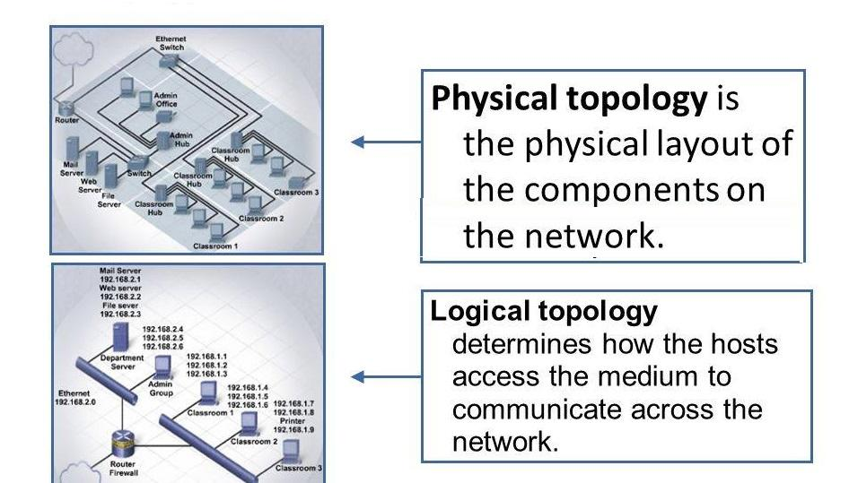
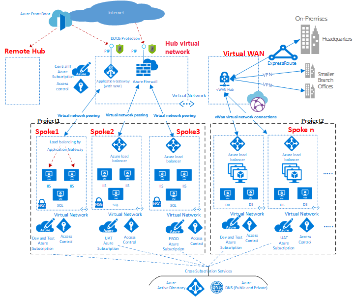

##### Wired Network Topology

- Physical Topology:
  - How devices are physically connected by media.
  
- Logical Topology:
  - How the actual traffic flows in the network

---

- Bus Topology
  - Uses a cable running through area that required network connectivity.
  - Each device "taps" into the cable using either a T connector or vampire tap.
  - Devices on cable form a `Single Collision Domain`. Meaning if they all try to talk each other at the same time then there would be a collision.

- Ring Topology
  - Uses a cable running in a circular loop
  - Each device connects to the ring, but data travels in a singular direction.
  - FDDI (Fiber networks) used two counter-rotation rings for redundancy.
  - On token ring networks, devices wait for a turn to communicate on ring by passing a token.

- Start Topology
  - Most popular physical LAN topology.
  - Devices connect to a single point.
  - Most commonly used with Ethernet cabling, but wireless or fiber are also used.
  - If the central device fails, the entire network fails.

- Hub and Spoke Topology
  - Used for connecting multiple sites
  - Similar to Star, but with WAN links instead of local are network connections.
  - Not redundant, if central office (hub) fails, the whole network can fail.
  

- Full Mesh Topology (Mesh)
  - Most redundant topology
  - Every node connects to every other node
  - Optimal routing is always available
  - Very expensive to maintain and operate
  - Number of connections `x = n(n-1)/2`

- Partial Mesh Topology (Hybrid)
  - Hybrid of the full-mesh and the hub-and-spoke topologies
  - Provides optimal routes between some sites, while avoiding the expense of connecting every site
  - Must consider network traffic patterns to design it effectively

