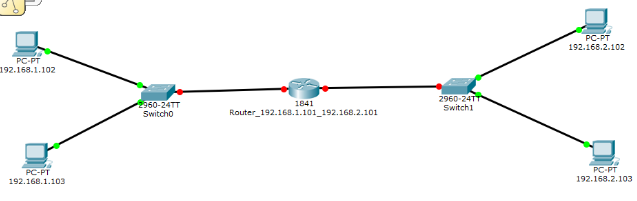
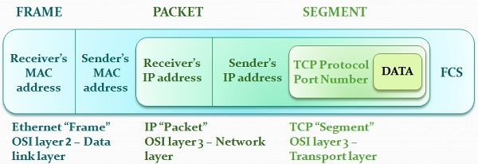

##### Introduction to IP Addressing

- Each NIC has its unique MAC address.
- Due to nature of MAC address(as they as fixed and static) it gets difficult to divide network into logical grouping and you end up creating large broadcast domain.
- To create large number of networks we need logical addressing, and IP Addressing is the most dominant way of logical addressing within network. 
- Unlike MAC address IP address are not fixed within Network Card(NIC), but we do assign IP address to NICs.
- IP Address can be used to identify a particular network. 
- So, how does IP address works with MAC address. For this we use `Router`.
- A `Router` connects multiple local area network(`LAN`).
- In this diagram you will see 2 switches connected to router.
- 
- So, Switch will take care of communication with a particular broadcast domain. And to communicate between different network will use a `Router`
- So for communication between 2 computer located in different network, you will need MAC address and the destination IP address.
- Within broadcast domain MAC address is sufficient to uniquely identify destination device. And a `frame` contains both source and destination MAC addresses.
- But now we need both MAC and IP addresses which is clubbed within a Frame and its called a `Packet`.
- 
- So, Packets always sit within Frame. 

---
- Now when a Computer in Network A wants to interact with Computer in Network B, it sends frame that has 
  - Source MAC address: Its onw MAC address 
  - Destination MAC address: MAC address of the `Default Gateway`
  - Source IP address
  - Destination IP address
  - Data, etc
- `Default Gateway` - When a host wants to reach a destination that is outside its own network, it has to use a default gateway. We use a router or multilayer switch (that’s a switch that can do routing) as a default gateway.
- Check default gateway on Linux machine:
  - ```shell
    route -n
    Kernel IP routing table
    Destination     Gateway         Genmask         Flags Metric Ref    Use Iface
    0.0.0.0         192.168.0.1     0.0.0.0         UG    600    0        0 wlp0s20f3
    169.254.0.0     0.0.0.0         255.255.0.0     U     1000   0        0 virbr0
    172.17.0.0      0.0.0.0         255.255.0.0     U     0      0        0 docker0
    172.18.0.0      0.0.0.0         255.255.0.0     U     0      0        0 br-a22840597dd6
    192.168.0.0     0.0.0.0         255.255.255.0   U     600    0        0 wlp0s20f3
    192.168.122.0   0.0.0.0         255.255.255.0   U     0      0        0 virbr0
    192.168.130.0   0.0.0.0         255.255.255.0   U     0      0        0 crc
    ```
- Now when Router receives this frame, it strips away the Source, Destination MAC address and any other frame stuff leaving only the `IP Packet`.
- And Router has routing table that directs to next hop. If the next network is connected to the router itself, it will be able to find the MAC address of the destination machine using the destination IP address from IP Packet.
- Then it will attach its own(Router's MAC) address, destination machine's MAC address and IP Packet and build the complete `Frame` and send it.
- Remember Packets never travels themselves, they're always encapsulated within a Frame.
- One thing to understand the content of frame changes based on where destination is located but IP Packet remains same. 
- One thing to understand the content of frame changes based on where destination is located but IP Packet remains same.


---
https://www.khanacademy.org/computing/computers-and-internet/xcae6f4a7ff015e7d:the-internet/xcae6f4a7ff015e7d:transporting-packets/a/transmission-control-protocol--tcp