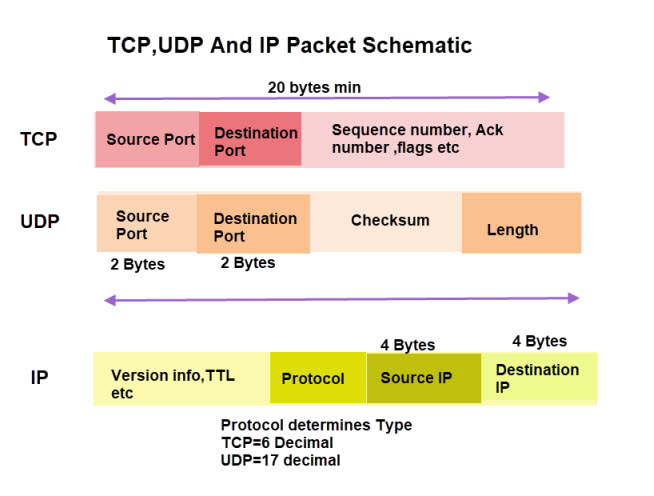

##### Packets and Ports

- Port numbers help direct packet traffic between the source and destination.
- Port 80 is used for world wide web to communicate over HTTP protocol.
- The first 1024 port numbers are known as `Well Known Ports` and are reserved and can never use as a return port number.
- You can have port number until `65536`.
- Port helps to move the data to the right target application, 
- But as we know we don't get complete data in one packet, and that's where TCP(Transmission Control Protocol) comes into plahy.
- TCP is a connection oriented protocol that creates a connection between 2 parties who want to exchange data.
- TCP makes sure that you get your data whole, complete and in order.
- Packets have sequence numbers so the network software can reassemble the file correctly.
- 2 Big blocks of TCP `Sequencing Number` which helps in ordering data in correct order and `Acknowledgement` is let the other party know that you have received that data don't resend again.

- UDP(User Datagram Protocol) - It is not connection oriented or connectionless, it just sends the data and doesn't control if data is received or not. Its application responsibility to try to get the failed data.
